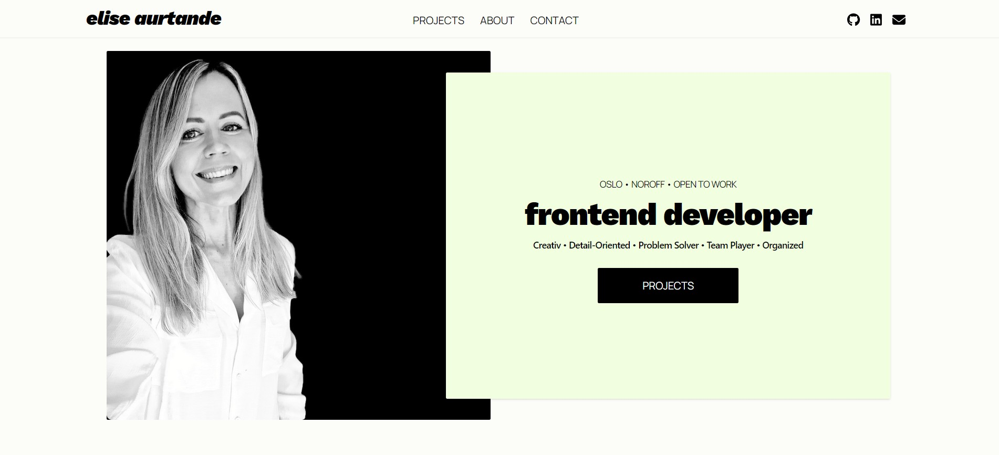
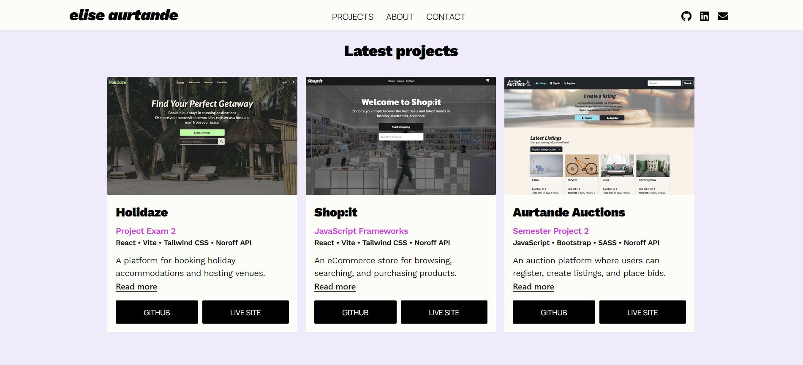

# Elise Aurtande Portfolio



A personal portfolio site showcasing my latest web development projects.

## Description

This portfolio highlights my work as a frontend developer, including project descriptions, images and links for Github and Live Sites. It also features an About section and a Contact section.

- Showcases multiple projects
- Responsive and modern design
- Built with React and Tailwind CSS



## Built With

- [React.js](https://reactjs.org/)
- [Vite](https://vitejs.dev/)
- [Tailwind CSS](https://tailwindcss.com/)

## Getting Started

### Installing

1. Clone the repo:

   ```bash
   git clone https://github.com/EliseAur/portfolio-2.git
   ```

2. Install the dependencies:

   ```bash
   npm install
   ```

### Running

To run the app, use the following command:

```bash
npm run dev
```

### Live Demo

**Link:** https://elise-aurtande.netlify.app

## Contributing

Contributions are welcome! Please open a pull request for any improvements or suggestions.

## Contact

Feel free to contact me if you have any questions or feedback about the project:

[My Linkedin](https://www.linkedin.com/in/elise-aurtande/)
